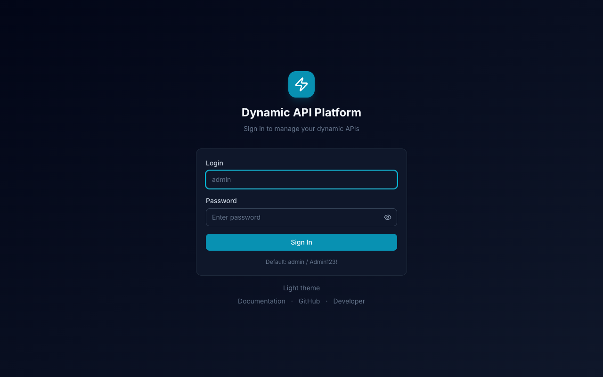
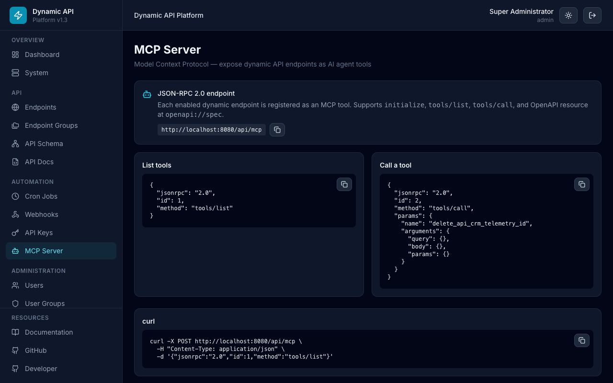
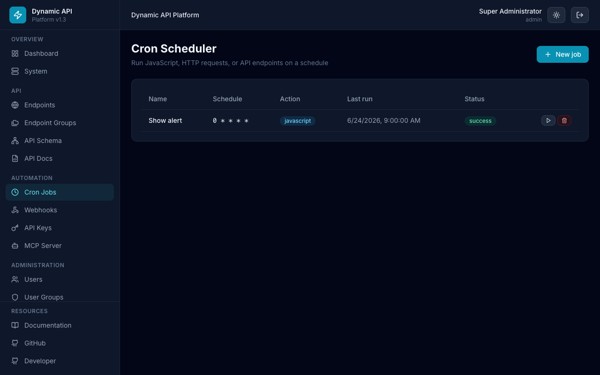
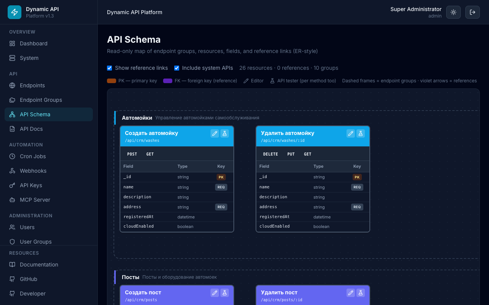
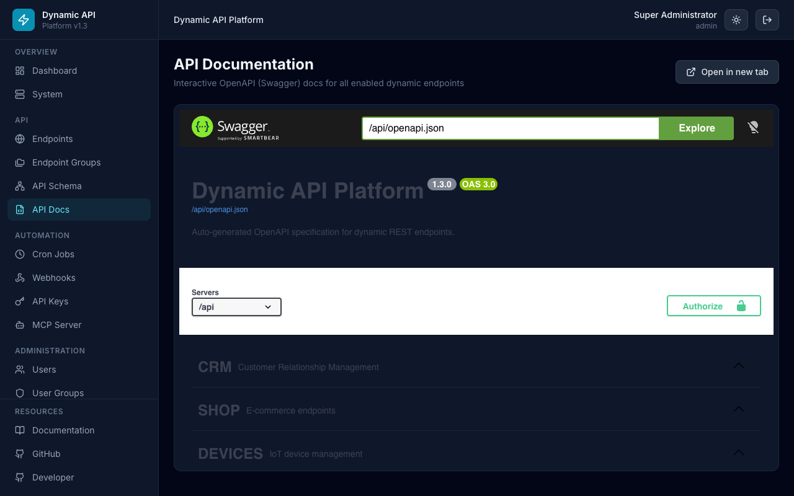
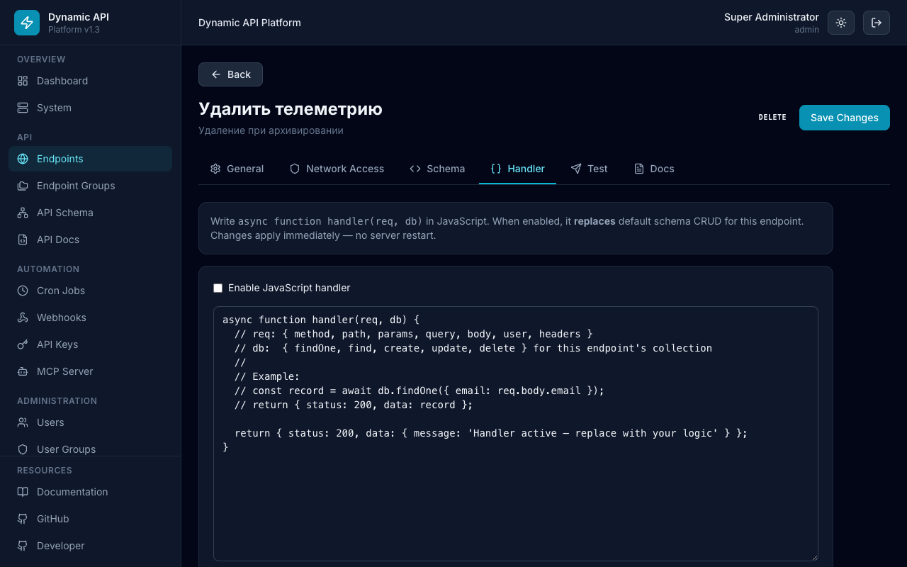
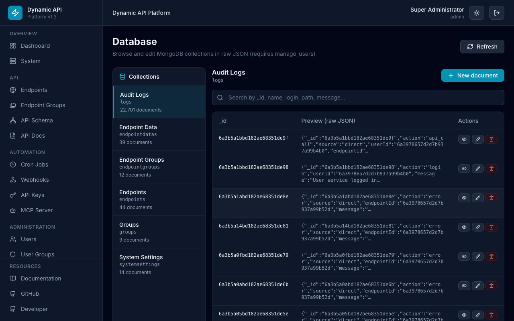
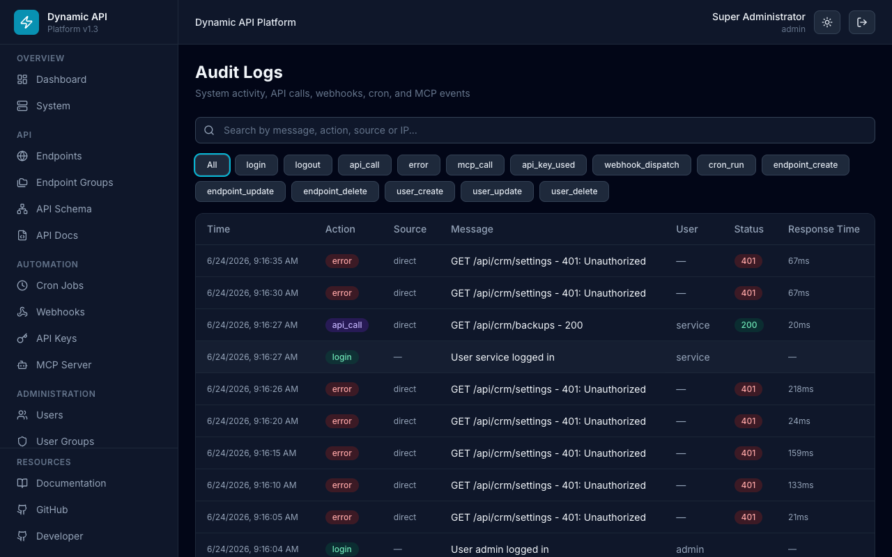
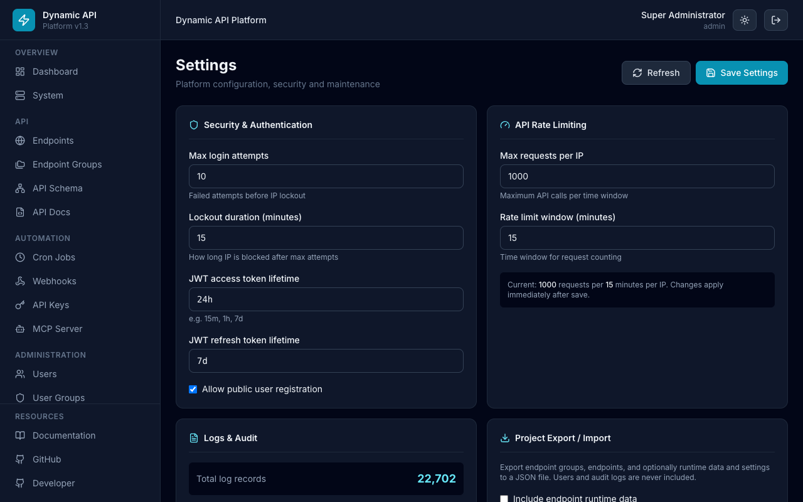
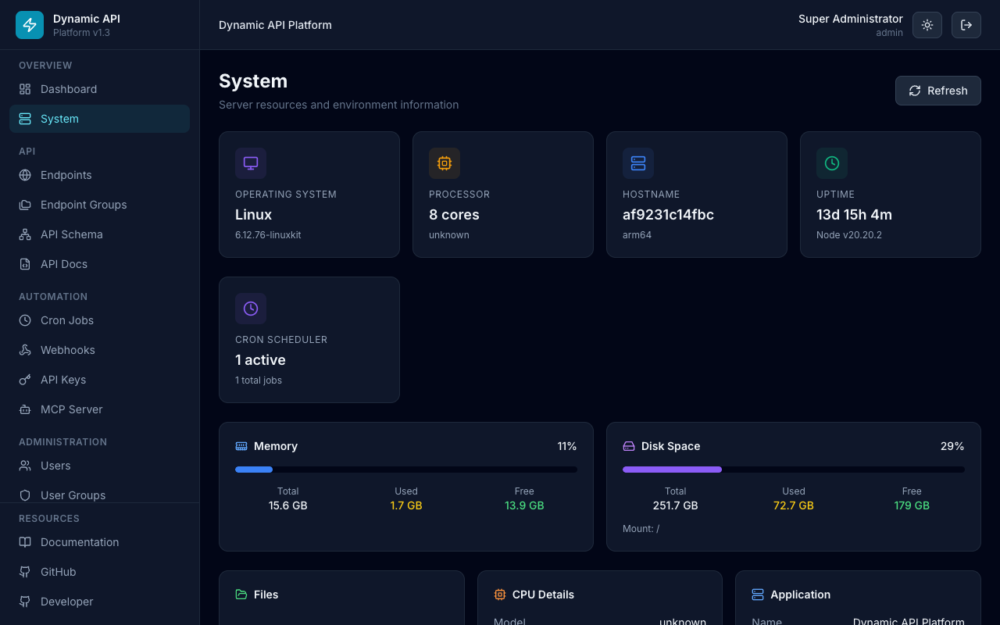

# Screenshots

Визуальный обзор интерфейса **Dynamic API Platform v1.4**.

- Полная галерея: [docs/screenshots.md](docs/screenshots.md)
- Онлайн: [GitHub Pages](https://dynamic-api-platform.github.io/Dynamic-API-Platform/screenshots/)
- Пересъёмка: `npm run screenshots` (нужен запущенный `http://localhost:8080`)

## Login & Dashboard

| Login | Dashboard |
|-------|-----------|
|  |  |

## Endpoints & Automation

| Endpoints | MCP Server | Cron Jobs |
|-----------|------------|-----------|
|  |  |  |

## API Schema, Docs, Handler

| API Schema | API Docs | Handler tab |
|------------|----------|-------------|
|  |  |  |

## Database, Logs, Settings, System

| Database | Logs | Settings | System |
|----------|------|----------|--------|
|  |  |  |  |
