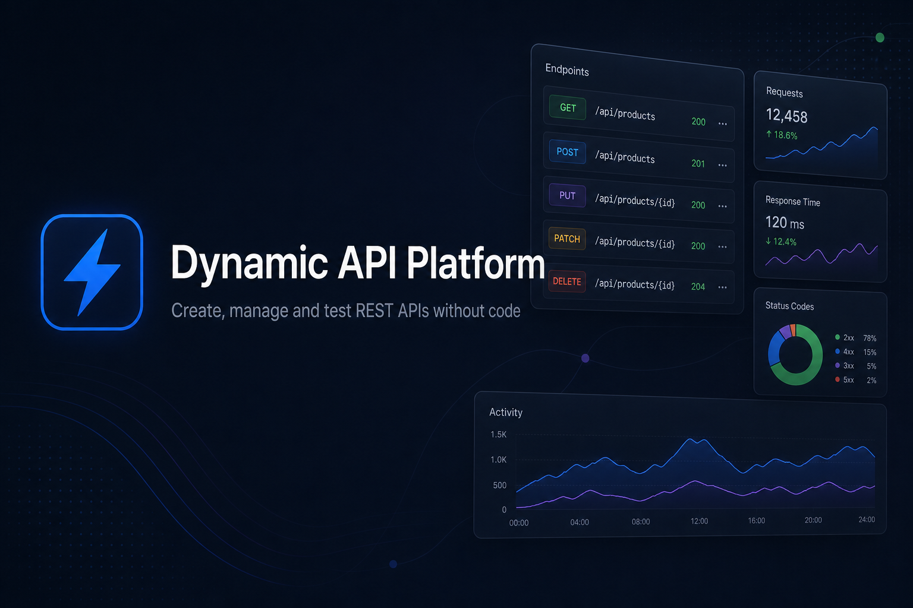
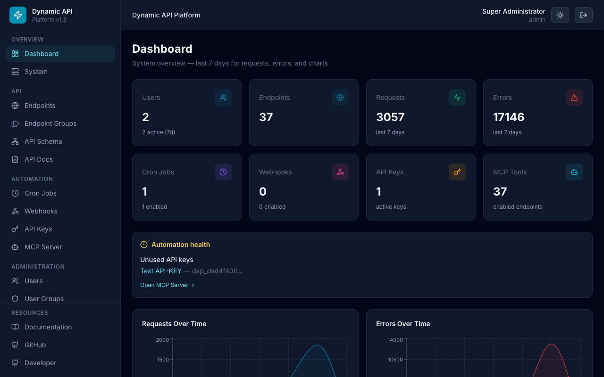
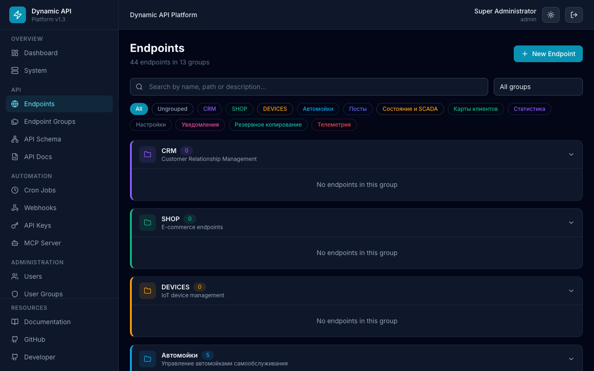

# Dynamic API Platform

<p align="center">
  
</p>

**Create, manage, and test REST APIs without writing backend code.**

Dynamic API Platform is an open-source full-stack application that lets you define REST endpoints through a web UI, attach JSON schemas, enforce access control, and serve data instantly — powered by MongoDB and a runtime API engine.

<p align="center">
  <a href="getting-started.html">Quick Start</a> ·
  <a href="architecture.html">Architecture</a> ·
  <a href="api-reference.html">API Reference</a> ·
  <a href="https://github.com/Developer-RU/dynamic-api-platform">GitHub</a>
</p>

---

## Features

| Category | Capabilities |
|----------|-------------|
| **Dynamic APIs** | CRUD endpoints defined in UI, schema validation, path params, grouped organization |
| **Security** | JWT auth, RBAC, rate limiting, login lockout, audit logs, Helmet, CORS |
| **Admin Panel** | Dashboard, endpoint editor, API tester, auto-docs, users & groups management |
| **DevOps** | Docker Compose one-command deploy, health checks, persistent volumes |
| **Search** | Full-text search on all data list pages (client + server side) |

## Quick Start

```bash
git clone https://github.com/Developer-RU/dynamic-api-platform.git
cd dynamic-api-platform
docker compose up -d
```

| Service | URL |
|---------|-----|
| Admin UI | http://localhost:8080 |
| Backend API | http://localhost:3001 |
| MongoDB | localhost:27017 |

**Default login:** `admin` / `Admin123!` — change immediately in production.

## Documentation Map

| Document | Description |
|----------|-------------|
| [Getting Started](getting-started.html) | Installation, first endpoint, curl examples |
| [Architecture](architecture.html) | System design, layers, data flow |
| [API Reference](api-reference.html) | All management API endpoints |
| [RBAC](rbac.html) | Permissions, groups, access types |
| [Dynamic API Engine](dynamic-api-engine.html) | How runtime endpoints work |
| [Deployment](deployment.html) | Docker, production, reverse proxy |
| [Configuration](configuration.html) | Environment variables & Settings UI |
| [Development](development.html) | Local dev setup, project conventions |
| [FAQ](faq.html) | Common questions |
| [Troubleshooting](troubleshooting.html) | Known issues and fixes |
| [Screenshots](screenshots.html) | UI gallery |

## Preview





[Full screenshot gallery →](screenshots.html)

## Tech Stack

- **Backend:** Node.js 20, Express, TypeScript, Mongoose, MongoDB 7
- **Frontend:** React 18, TypeScript, Vite, Tailwind CSS, Recharts
- **Infrastructure:** Docker, Docker Compose, Nginx

## License

[MIT License](https://github.com/Developer-RU/dynamic-api-platform/blob/main/LICENSE)
