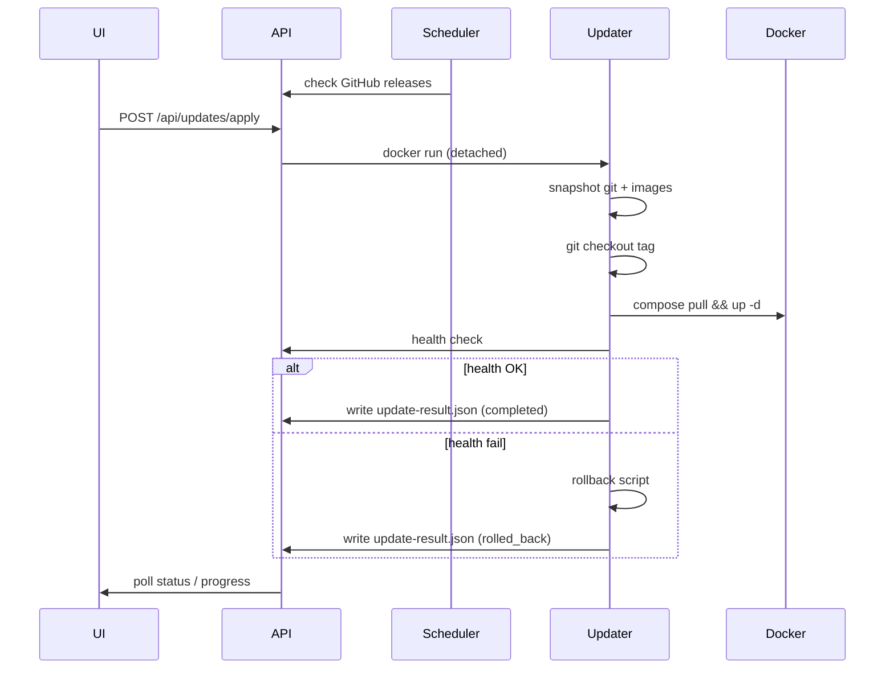

The platform can check [GitHub Releases](https://github.com/Dynamic-API-Platform/Dynamic-API-Platform/releases) for new versions, notify administrators in the UI, and optionally apply updates automatically with health verification and rollback on failure.

## Features

| Feature | Description |
|---------|-------------|
| **Version check** | Compares installed version with latest GitHub release |
| **Notifications** | Banner in the admin UI when a newer version is available |
| **Scheduled checks** | Configurable interval (Settings → Software Updates) |
| **Auto-update** | Optional scheduled install when a newer release exists |
| **Progress** | Step-by-step progress during update (snapshot → fetch → deploy → health) |
| **Cancel** | Cancel active jobs from Settings → Software Updates |
| **Stale job cleanup** | Jobs targeting an older version than installed are auto-failed on startup |
| **Auto-rollback** | Restores previous git ref and restarts services if health check fails |

## Settings UI

Open **Settings → Software Updates** (requires `manage_users` and `manage_api` permissions).

| Setting | Default | Description |
|---------|---------|-------------|
| GitHub repository | `Dynamic-API-Platform/Dynamic-API-Platform` | `owner/repo` for release API |
| Periodically check | On | Background polling on interval |
| Show notification | On | In-app banner when update available |
| Auto-update | Off | Install updates on schedule |
| Check interval | 24 hours | How often to query GitHub |
| Auto-update interval | 168 hours (7 days) | How often to attempt auto-install |
| Include pre-releases | Off | Use GitHub pre-releases |

## Out of the box (Docker)

`docker compose up -d --build` on a **local PC** or **VPS** enables in-app updates automatically:

- Docker socket and project directory are mounted into the backend
- **Settings → Software Updates** shows **Auto-update: Ready**
- **Update now** applies the latest GitHub release with progress and rollback on failure

Works with `git clone` (preferred) or a downloaded release archive — without `.git`, the updater downloads the release tarball from GitHub.

To disable: set `UPDATE_EXECUTOR_ENABLED=false` in `.env`.

## Check-only mode

If the executor is disabled, the platform still:

- Checks GitHub for new releases
- Shows notifications and release links

Manual upgrade follows normal [Deployment]({{ '/deployment/' | relative_url }}) steps.

## How auto-update works (Docker)

Auto-update runs a **detached updater container** on the host Docker socket so it survives backend restarts.

Default `docker-compose.yml` backend service (already configured):

```yaml
environment:
  UPDATE_EXECUTOR_ENABLED: "true"
  UPDATE_DEPLOY_MODE: docker
  UPDATE_COMPOSE_FILE: /deploy/docker-compose.yml
  UPDATE_PROJECT_ROOT: /deploy
  UPDATE_HOST_PROJECT_ROOT: ${DAP_HOST_PROJECT_ROOT:-${PWD}}
  DAP_HOST_PROJECT_ROOT: ${DAP_HOST_PROJECT_ROOT:-${PWD}}
  UPDATE_DATA_VOLUME: dap_update_data
  UPDATE_DOCKER_NETWORK: dap_default
  UPDATE_HEALTH_URL: http://backend:3001/api/health
volumes:
  - update_data:/app/data/updates
  - /var/run/docker.sock:/var/run/docker.sock
  - ${DAP_HOST_PROJECT_ROOT:-${PWD}}:/deploy
```

Replica stack: use `docker-compose.replica.yml` (`UPDATE_DEPLOY_MODE=docker-replica`, network `dap-replica-network`, volume `dap_update_data_replica`).

> **v1.5.11+:** When the updater runs inside a container, `docker compose` must bind-mount files from the **real host path**, not `/deploy`. The updater sets `DAP_HOST_PROJECT_ROOT` automatically; manual `docker compose` from the project directory uses `${PWD}`.

### Verify

In **Settings → Software Updates**, **Auto-update executor** should show **Ready**.

Use **Check now** to query GitHub, then **Update to vX.Y.Z** to test.

## Environment variables

| Variable | Default | Description |
|----------|---------|-------------|
| `APP_VERSION` | from `package.json` | Installed version reported to UI |
| `UPDATE_EXECUTOR_ENABLED` | `true` in Docker Compose | Allow apply/rollback from UI |
| `UPDATE_DEPLOY_MODE` | `docker` | `docker`, `docker-replica`, or `native` |
| `UPDATE_COMPOSE_FILE` | `/deploy/docker-compose.yml` | Compose file path inside mount |
| `UPDATE_PROJECT_ROOT` | `/deploy` | Project root inside updater container |
| `UPDATE_HOST_PROJECT_ROOT` | host path | Real host directory (passed to updater) |
| `DAP_HOST_PROJECT_ROOT` | `${PWD}` or env | Host path for compose bind mounts (v1.5.11+) |
| `UPDATE_DATA_DIR` | `/app/data/updates` | Job manifests, progress, logs |
| `UPDATE_HEALTH_URL` | `http://localhost:3001/api/health` | URL polled after deploy |
| `UPDATE_RUNNER_IMAGE` | `docker:26-cli` | Image for detached updater |

`UPDATE_HEALTH_URL` from the updater container should reach the backend after restart. On Docker Desktop use `http://host.docker.internal:3001/api/health`.

## Update flow



## API endpoints

All routes require authentication and `manage_users` + `manage_api`.

| Method | Path | Description |
|--------|------|-------------|
| `GET` | `/api/updates/status` | Current version, availability, active job |
| `POST` | `/api/updates/check` | Force GitHub check |
| `GET` | `/api/updates/settings` | Update settings |
| `PUT` | `/api/updates/settings` | Save update settings |
| `POST` | `/api/updates/apply` | Start update job |
| `POST` | `/api/updates/jobs/:id/cancel` | Cancel active job |
| `POST` | `/api/updates/dismiss` | Dismiss notification for version |
| `GET` | `/api/updates/jobs` | Recent jobs |
| `POST` | `/api/updates/jobs/:id/rollback` | Manual rollback |

## Security (v1.5.10+)

| Control | Description |
|---------|-------------|
| **githubRepo validation** | Settings value must be `owner/repo` only — blocks path-like or malformed values before GitHub API calls |
| **HSTS** | Enabled in production via Helmet |
| **Referrer-Policy** | `strict-origin-when-cross-origin` on API responses |

## Kubernetes

In-cluster auto-update is not enabled by default. Use your GitOps / CI pipeline (see [Kubernetes]({{ '/kubernetes/' | relative_url }})) to roll out new images. The check-and-notify UI still works if the backend can reach `api.github.com`.

## Troubleshooting

| Symptom | Cause / fix |
|---------|-------------|
| Executor **Not configured** | Set `UPDATE_EXECUTOR_ENABLED=true`, mount socket + project |
| Check fails | Outbound HTTPS blocked; verify `githubRepo` |
| Health timeout | Fix `UPDATE_HEALTH_URL`; ensure port reachable from updater |
| Stuck update banner | Stale job in DB — restart backend (auto-reconcile) or **Cancel** in Settings |
| **Latest on GitHub** shows old version | Click **Check now** — v1.5.8+ stores real GitHub latest; manual deploys auto-refresh cache |
| Rollback after update | Previous git ref restored; inspect `update_data` logs |
| **Backend/frontend won't start after in-app update** (v1.5.11 fix) | Updater used `/deploy` as host path for bind mounts — upgrade to **v1.5.11+** or run `docker compose up -d --build` from project root on host |
| `mounts denied: /deploy/...` on macOS | Same as above — ensure `DAP_HOST_PROJECT_ROOT` points to real host directory |

Logs: `{UPDATE_DATA_DIR}/update-{jobId}.log`
